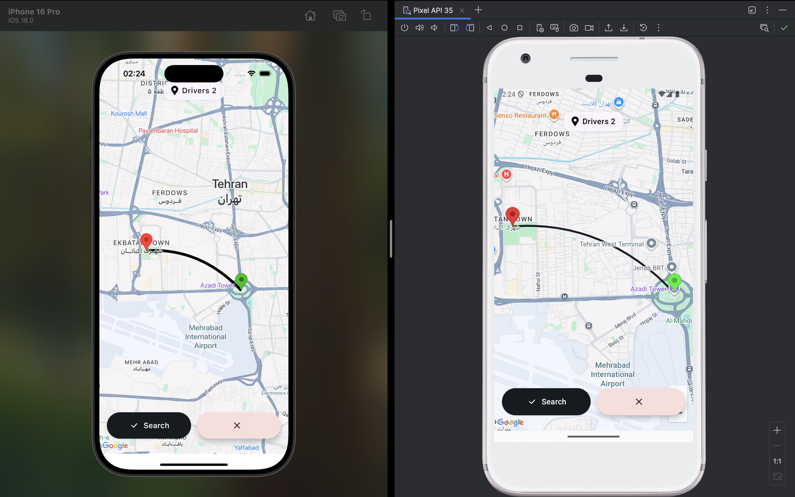
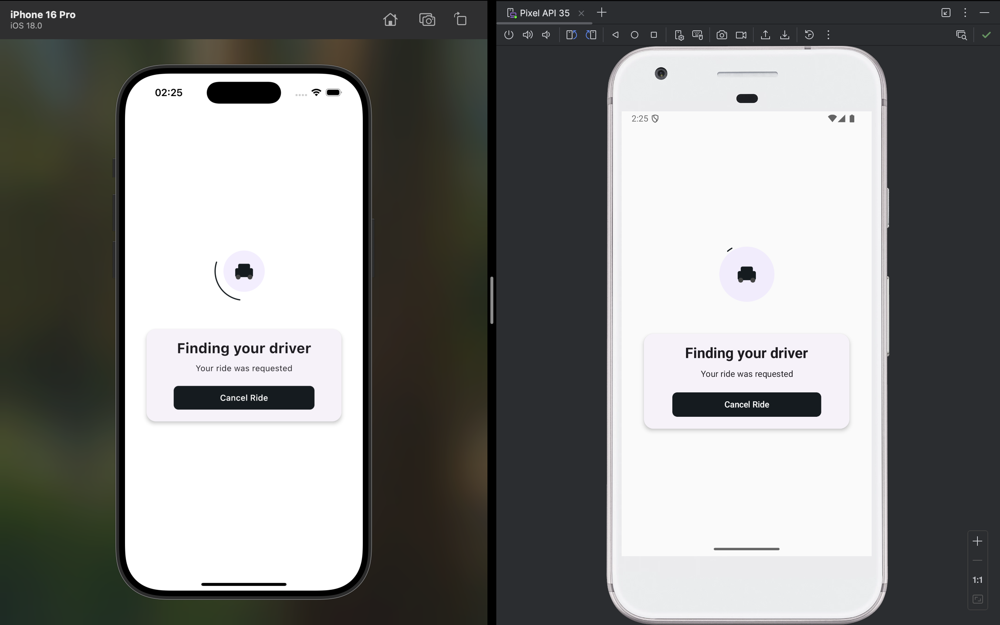

🚖 Mini Uber (Kotlin Multiplatform + Compose Multiplatform + VIPER)

A Mini Uber clone built with Kotlin Multiplatform (KMP) and Compose Multiplatform (CMP) to demonstrate:

🧩 VIPER Architecture in a cross-platform setup

🎨 Declarative UI with Compose Multiplatform

📦 Clean Architecture separation (data / domain / feature / core)

🧪 Testable, scalable design for mobile apps

This project is not a full Uber clone, but a simplified demo app to showcase architecture, structure, and best practices in KMP development.

📸 Screenshots
| Home Screen                     | Ride Screen                     |
| ------------------------------- | ------------------------------- |
|  |  |


✨ Features (so far)
📍 Show nearby drivers (fake data repository for now)
🚕 Request a ride with pickup & destination
⏳ Show ride status (waiting → on the way → completed)
🎯 Compose Router navigation between screens
🧩 VIPER layers: View, Interactor, Presenter, Entity, Router

🛠️ Tech Stack
Kotlin Multiplatform (shared business logic)
Compose Multiplatform (shared UI across Android, Desktop, iOS)
VIPER Architecture (feature separation & testability)
Coroutines & Flows (async data streams)
Clean Architecture (data/domain/feature separation)

## 📂 Project Structure
```
com.android.miniuber
 ┣ core
 ┃ ┣ di              # Dependency injection (for data core)
 ┃ ┣ base            # Base contract, abstractions
 ┃ ┗ platform        # AppRoute, ComposeRouter
 ┣ data
 ┃ ┣ di              # Dependency injection (for data layer)
 ┃ ┣ local           # Local data sources (DB, cache, etc.)
 ┃ ┣ network         # Network data sources (API, retrofit, ktor)
 ┃ ┣ repository      # Data layer implementations (e.g., FakeDriverRepositoryImpl)
 ┃ ┗ socket          # Socket or realtime connections
 ┣ domain
 ┃ ┣ di              # Dependency injection (domain layer)
 ┃ ┣ interactor      # Use cases / business logic (e.g., HomeInteractor)
 ┃ ┣ model           # Entities / models (Driver, Ride, Location)
 ┃ ┗ repository      # Repository interfaces (abstraction over data layer)
 ┣ feature
 ┃ ┣ home            # HomeContract, HomeEvent, HomePresenter, HomeScreen, HomeState
 ┗ ┗ ride            # Ride-related contracts, presenters, screens (WIP)
```
